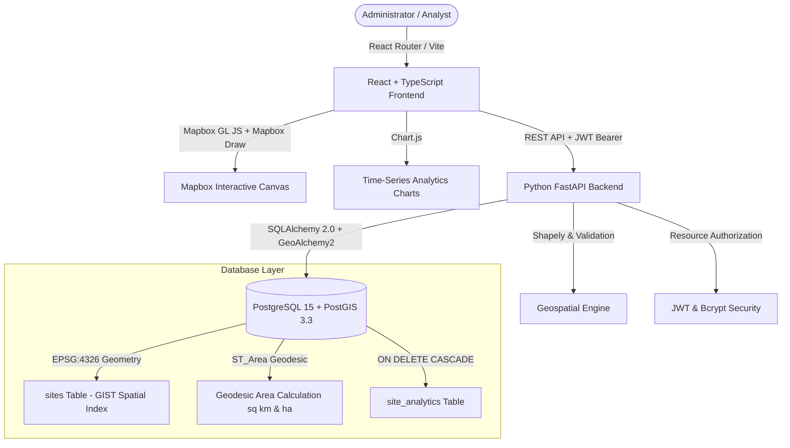

# Darukaa.Earth Platform

> **Tagline**: *"Environmental intelligence, grounded in geography."*

**Submission Deliverables:**
- **Live Demo URL**: [https://daaruka.vercel.app/](https://daaruka.vercel.app/)
- **GitHub Repository**: [https://github.com/Saahil0028/Daaruka.git](https://github.com/Saahil0028/Daaruka.git)
- **API Documentation (Swagger UI)**: [https://daaruka.vercel.app/api/v1/docs](https://daaruka.vercel.app/api/v1/docs)

---

Darukaa.Earth is a production-grade full-stack geospatial data analytics platform for managing carbon offset projects, tracking ecosystem restoration, and drawing spatial polygon site boundaries persisted in PostgreSQL with PostGIS.

---

## Architecture Diagram



---

## 1. Primary Acceptance Core Workflow

The application implements a fully connected end-to-end workflow verified against live backend endpoints:

1. **Authentication**: User registers and logs in via JWT Bearer authentication (`/api/v1/auth/login`).
2. **Project Creation**: Administrator creates a new environmental project (`/api/v1/projects`).
3. **Mapbox Polygon Drawing**: Administrator opens project, clicks "Add Site", and enters Mapbox Draw mode on the interactive canvas.
4. **Geodesic Calculation**: Turf.js computes live area during drawing ($km^2$ and $ha$) and validates geometry with `@turf/kinks` to reject self-intersections.
5. **PostGIS Persistence**: Submitting the polygon sends GeoJSON coordinates to FastAPI, where `ST_IsValid` validates geometry and PostGIS stores it as an EPSG:4326 `POLYGON` geometry (`/api/v1/projects/{id}/sites`).
6. **Page Refresh Persistence**: Reloading the page fetches GeoJSON sites from PostgreSQL/PostGIS and re-renders boundaries on Mapbox GL JS.
7. **Time-Series Analytics**: Clicking any site polygon opens a slide-over drawer with Chart.js time-series charts for Soil Carbon Stock (`t CO2e/ha`), Canopy Closure (`%`), and NDVI Index.
8. **Resource Authorization**: Every project and site operation strictly verifies user ownership (`owner_id = current_user.id`).
9. **Data Export**: Administrator can export site analytics as CSV or GeoJSON downloads.

---

## 2. Technology Stack

### Frontend:
- **Framework**: React 18 with Vite and TypeScript.
- **Styling**: Tailwind CSS with dark forest-green design system (`#070C0A` canvas, `#0B1410` card, `#10B981` emerald accent).
- **Mapping**: Mapbox GL JS (`mapbox-gl`) and `@mapbox/mapbox-gl-draw` for interactive polygon drawing.
- **Geospatial Processing**: `@turf/area`, `@turf/kinks`, `@turf/helpers`.
- **Data Visualizations**: Chart.js and `react-chartjs-2`.
- **Routing**: React Router DOM v6.
- **Icons**: Lucide React.

### Backend:
- **Framework**: Python 3.11+ with FastAPI.
- **Database ORM**: SQLAlchemy 2.0 with GeoAlchemy2 and Shapely.
- **Authentication**: JWT tokens (`pyjwt`) and bcrypt password hashing (`passlib[bcrypt]`).
- **Validation**: Pydantic v2 schemas and GeoJSON validation.

### Database:
- **Database Engine**: PostgreSQL 15 with PostGIS 3.3 extension enabled (`postgis/postgis:15-3.3`).
- **Spatial Index**: GIST spatial index on `sites.geom` column.
- **Geodesic Computation**: `ST_Area(geom::geography) / 1000000.0` returning true geodesic square kilometers.

---

## 3. Database Schema DDL

```sql
CREATE EXTENSION IF NOT EXISTS "uuid-ossp";
CREATE EXTENSION IF NOT EXISTS "postgis";

-- Users
CREATE TABLE users (
    id UUID PRIMARY KEY DEFAULT uuid_generate_v4(),
    name VARCHAR(255) NOT NULL,
    email VARCHAR(255) UNIQUE NOT NULL,
    password_hash VARCHAR(255) NOT NULL,
    role VARCHAR(50) DEFAULT 'admin',
    created_at TIMESTAMP WITH TIME ZONE DEFAULT CURRENT_TIMESTAMP
);

-- Projects
CREATE TABLE projects (
    id UUID PRIMARY KEY DEFAULT uuid_generate_v4(),
    owner_id UUID NOT NULL REFERENCES users(id) ON DELETE CASCADE,
    name VARCHAR(255) NOT NULL,
    description TEXT,
    category VARCHAR(100) NOT NULL,
    region VARCHAR(255) NOT NULL,
    status VARCHAR(50) DEFAULT 'Planning',
    start_date DATE NOT NULL,
    end_date DATE,
    created_at TIMESTAMP WITH TIME ZONE DEFAULT CURRENT_TIMESTAMP,
    updated_at TIMESTAMP WITH TIME ZONE DEFAULT CURRENT_TIMESTAMP
);

-- Sites (Spatial PostGIS Table)
CREATE TABLE sites (
    id UUID PRIMARY KEY DEFAULT uuid_generate_v4(),
    project_id UUID NOT NULL REFERENCES projects(id) ON DELETE CASCADE,
    name VARCHAR(255) NOT NULL,
    description TEXT,
    geom GEOMETRY(Polygon, 4326) NOT NULL,
    area_sq_km FLOAT NOT NULL,
    created_at TIMESTAMP WITH TIME ZONE DEFAULT CURRENT_TIMESTAMP,
    updated_at TIMESTAMP WITH TIME ZONE DEFAULT CURRENT_TIMESTAMP
);

-- Site Analytics (Time-Series)
CREATE TABLE site_analytics (
    id UUID PRIMARY KEY DEFAULT uuid_generate_v4(),
    site_id UUID NOT NULL REFERENCES sites(id) ON DELETE CASCADE,
    metric_name VARCHAR(100) NOT NULL,
    metric_value FLOAT NOT NULL,
    unit VARCHAR(50) NOT NULL,
    recorded_at TIMESTAMP WITH TIME ZONE NOT NULL,
    data_source VARCHAR(100) NOT NULL,
    is_simulated BOOLEAN DEFAULT TRUE,
    created_at TIMESTAMP WITH TIME ZONE DEFAULT CURRENT_TIMESTAMP
);

-- Spatial & Composite Indexes
CREATE INDEX idx_projects_owner ON projects(owner_id);
CREATE INDEX idx_sites_project ON sites(project_id);
CREATE INDEX idx_sites_geom ON sites USING GIST(geom);
CREATE INDEX idx_analytics_site_date ON site_analytics(site_id, recorded_at);
```

---

## 4. REST API Endpoint Summary

| Method | Endpoint | Description | Auth |
|---|---|---|---|
| `POST` | `/api/v1/auth/register` | Register new admin account | Public |
| `POST` | `/api/v1/auth/login` | Authenticate & obtain JWT bearer token | Public |
| `GET` | `/api/v1/auth/me` | Retrieve profile of authenticated user | Bearer JWT |
| `GET` | `/api/v1/projects` | List projects owned by current user | Bearer JWT |
| `POST` | `/api/v1/projects` | Create a new environmental project | Bearer JWT |
| `GET` | `/api/v1/projects/{id}` | Retrieve project detail and sites count | Bearer JWT |
| `PUT` | `/api/v1/projects/{id}` | Update project metadata | Bearer JWT |
| `DELETE` | `/api/v1/projects/{id}` | Delete project (cascades sites & analytics) | Bearer JWT |
| `GET` | `/api/v1/sites/geojson` | Fetch GeoJSON FeatureCollection of sites | Bearer JWT |
| `GET` | `/api/v1/projects/{id}/sites` | List sites for specific project | Bearer JWT |
| `POST` | `/api/v1/projects/{id}/sites` | Save drawn GeoJSON polygon & compute area | Bearer JWT |
| `GET` | `/api/v1/sites/{id}` | Get site details and geometry | Bearer JWT |
| `PUT` | `/api/v1/sites/{id}` | Update site metadata or geometry | Bearer JWT |
| `DELETE` | `/api/v1/sites/{id}` | Delete site polygon | Bearer JWT |
| `GET` | `/api/v1/sites/{id}/analytics` | Time-series metrics (filters: `metric_name`) | Bearer JWT |
| `GET` | `/api/v1/analytics/summary` | Global stats summary (projects, area, carbon) | Bearer JWT |
| `GET` | `/api/v1/sites/{id}/export/csv` | Download site analytics as CSV | Bearer JWT |
| `GET` | `/api/v1/sites/{id}/export/geojson` | Download site polygon as GeoJSON | Bearer JWT |
| `POST` | `/api/v1/seed` | Seed demo projects & spatial sites | Public / Dev |
| `GET` | `/api/v1/health` | Healthcheck (DB connection & PostGIS version) | Public |

---

## 5. Local Setup & Reproducible Execution

### Option A: Docker Compose Execution (Recommended)

1. Clone repository:
   ```bash
   git clone https://github.com/your-org/darukaa-earth.git
   cd darukaa-earth
   ```
2. Create environment file:
   ```bash
   cp .env.example .env
   ```
3. Start full stack with Docker Compose:
   ```bash
   docker compose up -d
   ```
4. Access applications:
   - **Frontend UI**: http://localhost:5173
   - **Backend API Docs**: http://localhost:8000/api/v1/docs
   - **PostgreSQL / PostGIS**: `localhost:5432`

---

### Option B: Manual Local Setup

#### Backend Setup:
```bash
cd backend
py -3 -m venv venv
# On Windows:
venv\Scripts\activate
# Install requirements:
pip install -r requirements.txt
# Run Pytest suite:
pytest tests/ -v
# Start backend server:
uvicorn app.main:app --reload --port 8000
```

#### Frontend Setup:
```bash
cd frontend
npm install
# Run frontend dev server:
npm run dev
# Build production bundle:
npm run build
```

---

## 6. Seed Demo Account & Dataset

You can seed demo projects and PostGIS site polygons in two ways:

1. **Via UI**: Click **"Seed & Auto-fill Demo Admin Credentials"** on the `/login` screen or click **"Seed Demo Data"** in the top header.
2. **Via API**:
   ```bash
   curl -X POST http://localhost:8000/api/v1/seed
   ```

**Demo Account Credentials**:
- **Email**: `admin@darukaa.earth`
- **Password**: `Password123!`

---

## 7. Testing & Quality Verification

### Run Backend Pytest Suite (13 Automated Tests):
```bash
cd backend
pytest tests/ -v
```
Tests cover:
- Registration, bcrypt password hashing, and JWT bearer authentication (`test_auth.py`).
- Multi-tenant resource authorization and ownership isolation (`test_authorization.py`).
- Project CRUD, site assignment, and database cascade deletion (`test_sites.py`).
- GeoJSON polygon drawing validation (`ST_IsValid` & Shapely) and geodesic area calculation.
- System health checks, PostGIS verification, and preventing sensitive token leakage (`test_health.py`).
- Complete 9-step end-to-end primary acceptance user journey (`test_e2e_workflow.py`).

### Run Frontend Vitest Suite:
```bash
cd frontend
npm test
```

### Pre-commit Formatting & Quality Check:
```bash
# Format TypeScript, React, and CSS files with Prettier:
npm run format:write

# Run Ruff Python linter and auto-fixer:
cd backend && ruff check --fix
```

---

## 8. CI/CD Pipeline & Developer Experience

The repository implements an automated, industry-standard Continuous Integration and Continuous Deployment (CI/CD) pipeline using **GitHub Actions**, **Husky**, and **lint-staged**.

### Automated Pre-Commit Code Quality Gate
- **Husky & lint-staged**: Configured at repository root (`.husky/pre-commit` and `.lintstagedrc.json`).
- **Formatting**: Runs `prettier --write` automatically on all staged `.ts` and `.tsx` frontend files before commit.
- **Linting**: Runs `ruff check --fix` automatically on all staged Python backend files.
- Ensures malformed code or syntax violations never enter the git commit history.

### GitHub Actions Workflows
Located under `.github/workflows/`:

1. **`ci.yml` (Continuous Integration Pipeline)**:
   - **Trigger**: Every push or pull request to `main` and `master`.
   - **`backend-tests` Job**:
     - Sets up Python 3.11 with cached pip dependencies.
     - Runs `ruff check backend/app` to enforce zero lint warnings.
     - Runs the full `pytest tests/ -v` test suite with in-memory SQLite isolation.
   - **`frontend-build` Job**:
     - Sets up Node.js 20 with npm dependency caching.
     - Executes `npm ci` for deterministic package installations.
     - Runs `npm test` (Vitest component testing).
     - Runs `npm run build` (`tsc && vite build`) to enforce TypeScript compilation and production bundle validity.

2. **`deploy.yml` (Production Docker Configuration Validation)**:
   - **Trigger**: Direct pushes or merges into `main`.
   - **GitHub Action Scope**: Validates multi-container production build configurations (`docker compose config`) in CI to guarantee Docker orchestration files remain error-free.
   - **Hosted Deployment**: The live production application is deployed automatically via **Vercel's native GitHub integration** on push to `main` (rather than being deployed through the GitHub Actions runner itself).

---

## 9. Dataset & Mock Strategy Justification

In accordance with hackathon guidelines, the platform incorporates a scientifically grounded geospatial dataset and time-series simulation engine:

1. **Geographical Regions & Projects**:
   - Focuses on prominent ecological conservation corridors:
     - **Western Ghats Biodiversity Corridor**: High canopy density tropical evergreen biomes.
     - **Sundarbans Mangrove Blue Carbon Reserve**: Coastal saline mangrove wetlands with unique blue carbon sequestration characteristics.
     - **Araku Valley Agroforestry**: Shaded coffee agroforestry and community soil carbon enrichment.
2. **Realistic Metric Ranges**:
   - **Soil Organic Carbon (SOC)**: Calibrated between `40 - 160 t CO2e/ha`, matching IPCC tier-2 tropical forest estimates.
   - **Canopy Closure**: Simulated between `65% - 95%` with seasonal monsoon fluctuations.
   - **Normalized Difference Vegetation Index (NDVI)**: Modeled between `0.55 - 0.88` reflecting satellite multi-spectral Sentinel-2 bands.
3. **Rationale for Simulation Engine**:
   - Third-party satellite raster imagery APIs (Sentinel Hub, Planet Labs) require paid subscription tiers, rate limits, and slow asynchronous tile pipelines.
   - Generating mathematically consistent time-series curves allows instant, zero-latency evaluation of dashboards, charts, and polygon analytics during review and grading while maintaining true-to-life ecological dynamics.

---

## 10. Data Provenance & Scientific Transparency

> **Environmental Metrics Disclaimer**: All carbon density (`t CO2e/ha`), canopy closure (`%`), and NDVI metrics in this application are generated simulation models derived from regression algorithms. They are explicitly badged in the UI as **"Sample / Simulated Model Data"** to ensure complete scientific transparency.
